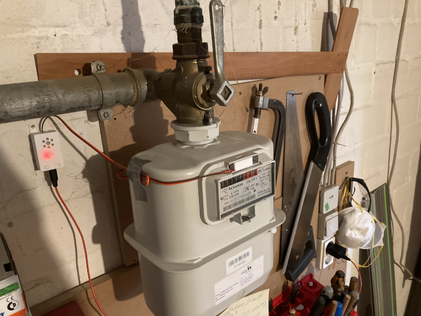
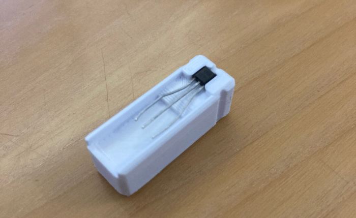
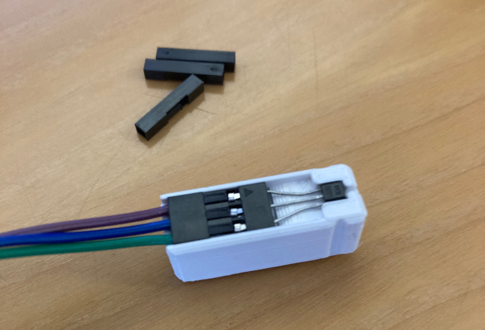
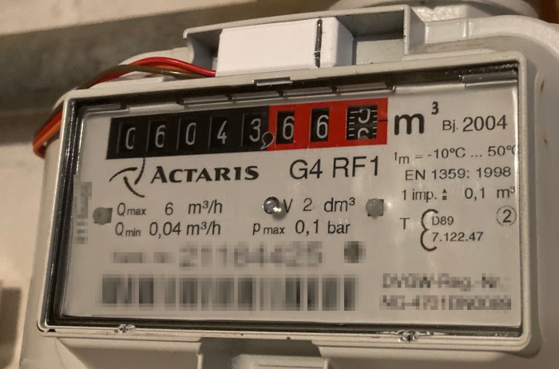
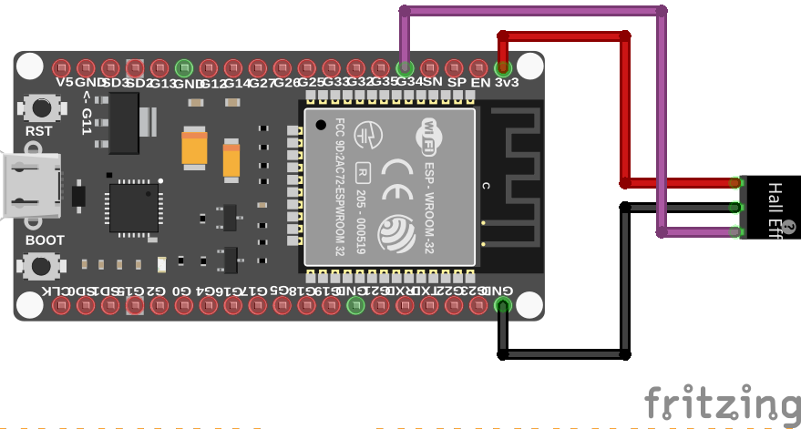
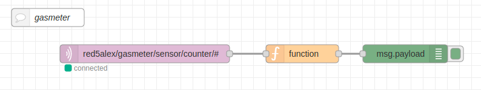

# HallEffectGasMeter

**Reading a Gas Meter with Magnetic Encoder using a Hall Effect sensor and an ESP32**

Building a device for reading the pulse count of a gas meter using a hall effect sensor, and sending the counter value to an MQTT broker for further processing. I tried it over one winter and it worked almost perfekt (lost about 1% of the pulses). **It was, however, necessary to solder the wires instead of using the DuPont connectors shown in the pictures below.**

**Note**: Besides using the magnetic counter, the Actaris G4 RF1 also features a reflective encoder on the .001-wheel, allowing for optic reading with 10-fold resolution than the magnetic encoder on the .01 wheel. I realized this only when I already had completed the build, and would have probably gone that way if I would have been aware of it earlier. I recommend to check out Geert Meersman's project https://github.com/geertmeersman/energie-meter which uses this approach.

## Hardware used

- 1 x hall effect sensor 4913B TLE4913 (49E)
- 1 x ESP32 or ESP8266 (or any microcontroller board with WiFi and ADC)
- 3 x Dupont wires (female-female)
- some kind of server to send MQTT messages to (e.g. node-red, home-assistant...)

This hall effect sensor is latching, meaning that it shifts between a HIGH and a LOW state with hysteresis.
The states do depend on the reference voltage of the ESP, so they are different if the board is powered using 3.3V input or 5V (USB).

Note: I tried a classic mechanical Reed sensor with this setup to no avail. Changing to a digital sensor with inbuilt hysteresis made the difference

## Checking the gasmeter

My gasmeter is an Actaris G4 RF1, however I am positive this setup can read-out any other meter with a magnetic pulse.

One of the rollers contains a magnet encoder. I was able to figure out which one it is by moving a strong magnet in the vicinity which caused the relevant one to wiggle a little bit. The sensor must be placed close to this roller.

## 3D printed sensor holder

To hold the sensor in place, I have created a printable piece of plastic that press-fits into the slot above the holder and holds the sensor and cable firmly in place. Find the 3D print files here: https://www.printables.com/model/247665-hall-effekt-gas-meter-reader

The CAD model (made in OnShape) can be found [here]([https://www.google.com](https://cad.onshape.com/documents/e0d259fd877c1182a09bbc17/w/994389497a324f97073d213b/e/8d6a3ead179d19c52f29340c?renderMode=0&uiState=62d9d468549a2247567e7bfb)

If you do not have a 3D printer, play dough should do just fine :)

After printing, the sensor slides into the little notch. Now, attach the dupont cables to the sensor's terminals and press them into the little grove.
On the picture, I replaced the three original single dupont shells with a triple one, which makes handling a bit easier. If you go with the original terminals, you can secure them by wrapping sticky tape around it.
**Note from future author**: I only got a stable connection when actually soldering the wires, the Dupont connectors created false readings from time to time.

The whole assembly now slides into the slot above the digit rollers of the meter. There is a slit on the side of the mount to indicate the sensors position (highlighted with a pen on the picture), which should be placed directly above the roller containing the magnet.

## Wiring

Connect the opposite end of the Dupont cables with the corresponding terminals of the Microcontroller>

- GND to GND
- 3V3 to 3V3
- The signal terminal to GPIO34

You can choose another GPIO with ADC capability (see pinout of you DevBoard). Note: On ESP32, you cannot use the pins connected to ADC2 when using WiFi.

## The Ardunio Sketch

The Arduino sketch in the repository contains several configuration files:

- `are_wifi_config.h` sets the hostname and LED port
- `are_mqtt_config.h` configures the MQTT broker, topic etc. If using a public broker (e.g. HiveMQ), make sure to change the default topic.
- `credentials-template.h` must be renamed to `credentials.h`. Add you WiFi name and password here)
- The pinout for the LED and Sensor input can be changed in the `arduino-sketch.ino` directly.

Compile and upload, and check the Serial monitor.
At startup, the LED (if present) will flash until network connectivity is present.

After that, the status LED will be on if the sensor is connected but not detecting the presence of the magnet. Check the connection if it does not come up.

Place a magnet close to the sensor and check if it will turn off. If not, you may need to adjust the threshold voltage in the code (it differs e.g. if powering the ESP32 board via a 5V supply (USB) or a 3.3V supply).

If your board has no in-built or external LED, use the Serial Monitor instead.

## 3D printed case for MicroController

DuPont wires do not attach very reliantly on the ESP32 connectors, so it is advisable to encapsulate the microcontroller to make sure they do not fall off when moving the cables.

I used the [ESP32 Open MQTT gateway box](https://www.thingiverse.com/thing:5345637) by [Simedru Florin](https://https://www.thingiverse.com/simedruflorin) as an enclosure for my ESP32 DevKit (Checkout his designs if using other boards, e.g. ESP8266).

The Dupont cables can be routed through its openings and secured with hotglue. Below a picture of the final assembly:

## Example Application with Node-RED

The repository contains a minimal appliacation example, where the ESP32 sends the current count via an MQTT broker to node-red.

